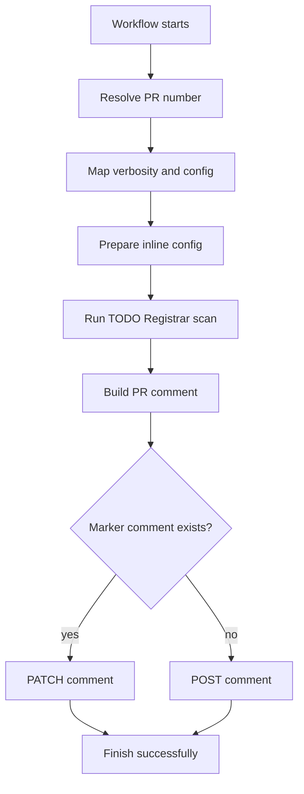

# How it works

TODO Registrar Statistic Action is a [composite action](https://docs.github.com/en/actions/creating-actions/creating-a-composite-action)
that runs [TODO Registrar](https://github.com/Aeliot-Tm/todo-registrar) against the pull request branch and posts
a sticky summary comment on the pull request.

## Overview

On each run, the action:

1. Resolves the pull request number from the `pull_request` event payload.
2. Prepares runtime options (verbosity, configuration).
3. Scans the repository for TODO comments without an issue key.
4. Builds a markdown comment from the processing report.
5. Creates or updates a single PR comment identified by an HTML marker.



## Step-by-step

### 1. Resolve pull request number

Reads `pull_request.number` from `GITHUB_EVENT_PATH`. Fails when the action was not triggered on a `pull_request` event.

### 2. Prepare runtime options

**Map verbosity to flag** converts the `verbosity` input into a TODO Registrar CLI flag.

### 3. Prepare configuration

Configuration is passed to TODO Registrar as inline YAML:

- If `config` input is set — uses the provided YAML.
- If `config` is empty — uses the [built-in default](#built-in-configuration).

### 4. Run TODO Registrar

Starts the Docker container `ghcr.io/aeliot-tm/todo-registrar:4.1.0` with the workspace mounted at `/code`.
The container writes a JSON processing report to `${RUNNER_TEMP}/todo-registrar-report.json`.

The scan is read-only: no issues are created in a tracker and no source files are changed.

### 5. Build PR comment

[`scripts/build-pr-comment.sh`](../scripts/build-pr-comment.sh) generates markdown from the report.

The comment describes the **current** unregistered TODO state of the scanned codebase on the PR branch head.
It does not claim that all listed TODOs were added in this pull request.

### 6. Upsert PR comment

[`scripts/upsert-pr-comment.sh`](../scripts/upsert-pr-comment.sh) finds an existing comment containing
`<!-- TODO-REGISTRAR-STATISTIC:START -->` and updates it, or creates a new comment if none exists.

The action always completes successfully. When no unregistered TODOs are found, the comment says so.

## Limitations

- The processing report provides per-file counts only — no line numbers or TODO text.
- Statistics cover the full scanned codebase (`paths` from config), not a git diff filter.
- Fork pull requests are skipped (the default token cannot comment on upstream PRs).
- Per-issue details from the processing report are not shown in the PR comment in v1.

## Built-in configuration

When `config` is empty, the action uses:

```yaml
paths:
  in: /code
registrar:
  type: DryRun
```

For a custom `config`, keep the same `registrar` block and change `paths`, `tags`, or `process` as needed.
See [TODO Registrar configuration](https://github.com/Aeliot-Tm/todo-registrar/blob/main/docs/config/general_config_yaml.md).

### How the scan runs internally

The action invokes TODO Registrar with `--dry-run` and `registrar.type: DryRun` so that parsing and statistics
work as in a normal registration run, but without tracker API calls or writes to source files.
See [Dry-run mode](https://github.com/Aeliot-Tm/todo-registrar/blob/main/docs/dry_run.md) in the TODO Registrar documentation.

## Related documentation

- [Inputs](inputs.md)
- [Permissions](permissions.md)
- [Examples](examples.md)
- [TODO Registrar processing report](https://github.com/Aeliot-Tm/todo-registrar/blob/main/docs/report.md)
